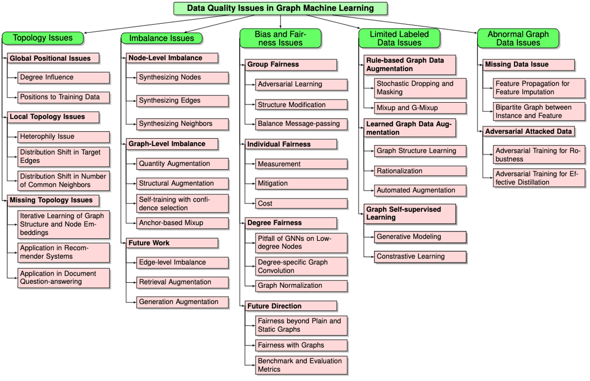

## Abstract

Recent years have witnessed a significant shift from just model-centric AI, which focuses on developing top-performing models, to also data-centric AI, which emphasizes the quality and refinement of the data used in AI models with most of these efforts in computer vision and natural language processing domains (i.e., image and text). Concurrently, graph machine learning (GML), such as Graph Neural Networks (GNNs) has emerged as a rising approach for analyzing graph-structured data by fusing the topological information via message-passing and the feature information via neural transformation. Despite GML's unprecedented success in pushing the boundary of state-of-the-art performance in graph-based tasks, its strong dependence on node features and graph topology also makes it vulnerable to data-quality issues, which can catastrophically impair GML performance. On the one hand, graph-structured data, like many other data modalities, suffer from conventional data-quality issues, e.g., imbalance and bias. On the other hand, the intrinsic complex and abstract nature of graph topology can potentially exacerbate the aforementioned issues and brings up new ones. For example, the imbalance issue that initially happens at the quantitative level could also occur at the topological level. The inherent bias encoded in the sensitive feature space might get amplified after the message passing in GNNs. These issues severely impair downstream task performance and are challenging to diagnose due to graphs' inherent complexity and abstraction. In view of the criticality and ubiquity of the graph-data quality issues in compromising GML performance, our tutorial aims to make a timely contribution by sensitizing the graph ML community towards graph data-quality issues while (1) introducing the background and motivation behind GML,  (2) giving a bird's eye view of existing graph-data quality issues, (3) selectively presenting representative works in studying/solving these issues, and (4) discussing crucial challenges for future work. 

## Time and Location
Time: 3:15 - 5:15 pm (CT)  
Location: Mesquite Room (at The Westin Houston, Memorial City in Houston, TX)

## Tutorial Outline

<ul>

  <li>
    Introduction and Background
    <ul>
      <li> Graph-structured data, GML, and GNNs</li>
      <li> Summary of Graph Data Quality Issues</li>
    </ul>
  </li>
  
  <li>
    Topology Issues
    <ul>
      <li> Global Positional Issues</li>
      <li> Local Topology Issues</li>
      <li> Missing Graph Issues</li>
      <li> Future Directions</li>
    </ul>
  </li>
  
  <li>
    Imbalance Issues
    <ul>
      <li> Node-level Imbalance</li>
      <li> Edge-level Imbalance</li>
      <li> Graph-level Imbalance</li>
      <li> Future Directions</li>
    </ul>
  </li>
  
  <li>
    Bias Issues
    <ul>
      <li> Group Fairness on Graphs</li>
      <li> Individual Fairness on Graphs</li>
      <li> Degree Fairness on Graphs</li>
      <li> Future Directions</li>
    </ul>
  </li>
  
  <li>
    Limited Labeled Data Issues
    <ul>
      <li> Graph Data Augmentations</li>
      <li> Self-supervised Learning on Graphs</li>
      <li> Future Directions</li>
    </ul>
  </li>

    
  <li>
    Abnormal Graph Data Issues
    <ul>
      <li> Missing and Noisy Features</li>
      <li> Adversarially Attacked Data</li>
      <li> Future Directions</li>
    </ul>
  </li>
  
</ul>

## Summary

## Slides
You can download our slides or see them embedded below.
Download <a href="https://yuwvandy.github.io/_pages/tutorial_ppt.pdf"> link</a>

## Speakers Bio's

<b>Yu Wang</b> is a Ph.D. candidate of Computer Science at Vanderbilt University. His research focuses on data-centric graph machine learning, data-quality aware graph neural networks with applications in recommender systems and information retrieval. He has published in top conferences (e.g., KDD, WWW, WSDM, AAAI and CIKM) and has also served as a program committee member/reviewer at AAAI, SDM, KDD, TKDD, TKDE, etc. He has received numerous awards including Vanderbilt's Graduate Leadership Anchor Award for Research in 2023 and Vanderbilt's C.F. Chen Best Paper Award in 2022. More details are in <a href="https://yuwvandy.github.io/">https://yuwvandy.github.io/</a>. 
 

<b>Yijun Tian</b> is a Ph.D. candidate of Computer Science and Engineering at the University of Notre Dame. His research interests lie in graph learning, machine learning, and data science. He focuses on developing GNNs that are knowledge-enhanced, self-supervised, and robust. He has published 20+ papers in top conferences including ICLR, ICML, AAAI, IJCAI, WWW, etc. He has served as program committee member and reviewer at NeurIPS, SDM, CIKM, KDD, AAAI, TKDE, etc.
 

<b>Tong Zhao</b> is a Research Scientist in the User Modeling and Personalization group at Snap Research. He earned a Ph.D. in Computer Science and Engineering at University of Notre Dame in 2022. His research focuses on graph machine learning as well as their applications in real-world use cases. His work has resulted in 30+ conference and journal publications, in top venues such as ICML, ICLR, NeurIPS, KDD, AAAI, WWW, TNNLS, etc. He also was the organizer and presenter at multiple workshops and tutorials on GNNs at KDD'22, ICDM'22, SDM'23, KDD'23, ICDM'23. 
 

<b>Xiaorui Liu</b> is an assistant professor in the Computer Science Department at North Carolina State University. He received his Ph.D. degree in Computer Science from Michigan State University in 2022. His research interests include deep learning on graphs, large-scale machine learning, and trustworthy artificial intelligence. He has published innovative works in top-tier conferences such as NeurIPS, ICML, ICLR, KDD, AISTATS, and SIGIR. He was awarded the ACM SIGKDD Outstanding Dissertation Award (Runner-up) in 2023, Amazon Research Award in 2022, Chinese Government Award for Outstanding Students Abroad in 2022, and Best Paper Honorable Mention Award at ICHI'19. He has organized and co-presented two tutorials related to Graph Machine Learning at KDD'21 and KDD'23.  More information about him can be found at <a href="https://sites.google.com/ncsu.edu/xiaorui/">https://sites.google.com/ncsu.edu/xiaorui/</a>.
 

<b>Jian Kang</b> is an Assistant Professor in the Department of Computer Science at the University of Rochester. His research aims to develop data mining and machine learning techniques on graphs that are trustworthy and can advance scientific discovery. He was recognized as Rising Star in Data Science by The University of Chicago, Mavis Future Faculty Fellow by the University of Illinois Urbana-Champaign and top reviewer at multiple conferences (ICML 2020, ICLR 2021, CIKM 2021, NeurIPS 2022, LOG 2022). He received his Ph.D. in Computer Science from the University of Illinois Urbana-Champaign. He has presented three tutorials on fair graph learning (CIKM 2021, KDD 2022, SDM 2023) and organized one workshop on trustworthy graph learning (CIKM 2022).
 

<b>Tyler Derr</b> is an Assistant Professor in the Department of Computer Science at Vanderbilt University and directs the Network and Data Science (NDS) lab, which conducts research in the areas of data mining and machine learning, with emphasis on (1) social network analysis and recommender systems, (2) deep learning on graphs, (3) responsible and trustworthy AI, and (4) interdisciplinary social good applications. He is actively involved in top conferences in his field, both in terms of publishing and serving as a PC/SPC member, while receiving recognition such as the Best Student Poster Award at SDM’19 and Best Reviewer Awards at ICWSM’19/’21, as well as WSDM’22. He has contributed to the organization of numerous international conferences and workshops, including serving on the organizing committee of KDD (2021-2024), DSAA (2024), and WSDM (2022, 2024), along with co-founding the Machine Learning on Graphs (MLoG) Workshop at WSDM (2022-2024) along with at ICDM (2022-2023). Being passionate about sharing knowledge, he has delivered tutorials on Graph Neural Networks at KDD’20, AAAI’21, and SDM'24. He serves as Associate Editor for four journals including Tsinghua Science and Technology and IEEE Transactions on Big Data. Tyler has received several awards including Vanderbilt's Fall 2020 Teaching Innovation Award from the School of Engineering and the NSF CAREER Award in 2023. More details can be found at  <a href="https://www.TylerDerr.com">http://www.TylerDerr.com</a>. 

  
